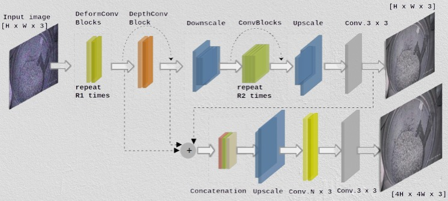
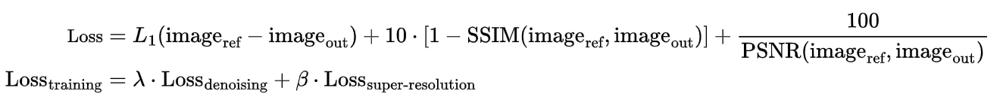

# DDSRNet

## Paper

This implementation is based on our paper published at the **2025 Seventeenth International Conference on Quality Control by Artificial Vision; 1373705 (2025)**: [Read the Paper on arXiv](https://doi.org/10.48550/arXiv.2509.01332)

## Citation
```bibtex
@inproceedings{messai2025enhancing,
  title={Enhancing image quality and anomaly detection for small and dense industrial objects in nuclear recycling},
  author={Messai, Oussama and Zein-Eddine, Abbass and Bentamou, Abdelouahid and Picq, Micka{\"e}l and Duquesne, Nicolas and Puydarrieux, St{\'e}phane and Gavet, Yann},
  booktitle={Seventeenth International Conference on Quality Control by Artificial Vision},
  volume={13737},
  pages={21--28},
  year={2025},
  organization={SPIE}
}
```

## Overview

DDSRNet (A Deep Model for Denoising and Super-Resolution) is a new two-stage learning architecture designed for simultaneous image denoising and super-resolution. By decoupling these complex tasks, DDSRNet enables specialized processing for each, leading to more effective noise removal and higher-quality upscaling.

### Features

- **Two-Stage Architecture**: Decoupled denoising and super-resolution stages for specialized processing
- **Advanced Loss Function**: Novel composite loss combining multiple image quality metrics for robust training
- **Multi-Task Learning**: Simultaneous optimization of denoising and super-resolution objectives
- **High-Quality Output**: Enhanced image quality through specialized loss components

#### Advanced Loss Function

DDSRNet employs a sophisticated composite loss function that combines multiple image quality metrics:



**Composite Loss Components:**
- **L1 Loss**: Pixel-wise absolute difference between reference and output images
- **SSIM Loss**: Structural similarity index measure for perceptual quality (weighted by 10)
- **PSNR Loss**: Peak signal-to-noise ratio optimization (weighted by 100/PSNR)

**Training Loss:**
```
Loss_training = λ × Loss_denoising + β × Loss_super-resolution
```

Where λ and β are weighting coefficients that balance the contribution of each task-specific loss component.


## Requirements

Ensure you have the following dependencies installed:

- Python 3.6 or higher
- [PyTorch](https://pytorch.org/)
- [TensorBoardX](https://github.com/lanpa/tensorboardX)
- [torchsummary](https://github.com/sksq96/pytorch-summary)
- SciPy
- NumPy
- Pillow
- Matplotlib
- YAML

You can install all the required packages using the provided `requirements.txt` file.


## License

This project is licensed under the MIT License. See the [LICENSE](LICENSE) file for details.

